# Boost up 4x Request per minute for your AOAI Resources
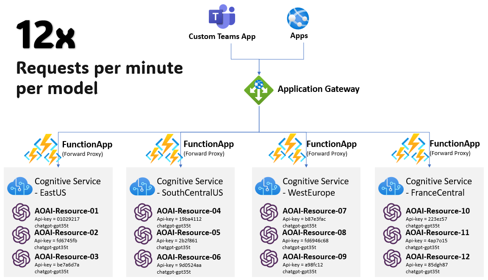

## Fully utilize AOAI quotas and limits
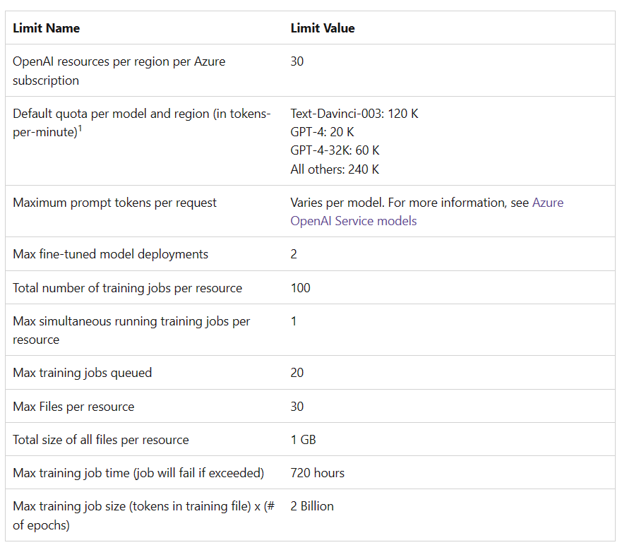

As at 12 June 2023, **one subscription** can provision **30 AOAI resources per region**, sharing the same TPM and RPM limits. For example, you can allocate 3 deployment instances of GPT-35-Turbo with 80K TPM/480 RPM each to utilize the whole TPM/RPM limits for one region.

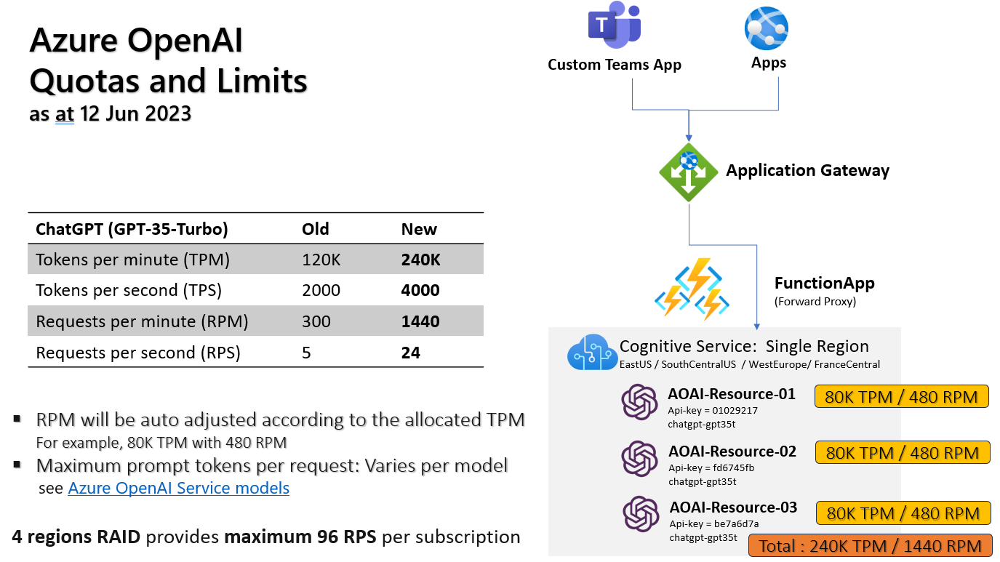

As at June 2023, there are four regional Cognitive services that support Azure OpenAI -*EastUS, South Cental US, West Europe and France Central* which allows for a **maximium 120 instances** of the same AOAI model can be provisoned across these four regions. This means you can achieve up to *(1440x4/60)* = **maximium 96 request per second** for your ChatGPT model per subscription. If this is still not enough to meet your production workload requirements, you can consider getting additional subscriptions to create an AOAI resources RAID.

*The per region throttle limit being set is 24 RPS. However, the actual RPS is determined by the number of tokens being sent by your API. **For instance, if the request body of the chatcompletion API call contains 3000 tokens, with 1000 tokens reserved for the response (MaxToken), the RPS for this scenario would be 1**. This means that any additional API calls sent to the AOAI endpoint within the same concurrent second will be throttled and receive a HTTP 429 response code.


## Why not just raise your quotas and limits?
You can apply for quota increase requests by filling out forms, but this may not be the most practical solution as it won't give you access to the additional resources right away. What if your AOAI service demand continues to grow? Utilizing your existing quotas is the more practical solution. Remember, you have a maximum of 120 model instances across 4 regions with 4 times quotas and limits for 1 subscription. If you don't have concerns about cross-region networking cost, spanning across regions is the fastest way to get your production rollout up and running.

## Load balancing multiple AOAI Resources 


The common practice is to use Azure Application Gateway (AppGW) to perform a round-robin traffic distribution, alongside Azure DDoS service to protect your cloud telemetry. However, the rewrite rule capability of AppGW cannot rewrite the API key immediately after an AOAI resource is designated as a backend target. Therefore, a forward proxy server for each particular AOAI endpoint needs to be added to change the corresponding API key. As a result, you will need to provision three Function Apps per region to serve as the forward proxy servers. Don’t worry, these Function Apps can share the same App Service Plan. 


## Transforming your API with actual AOAI endpoints
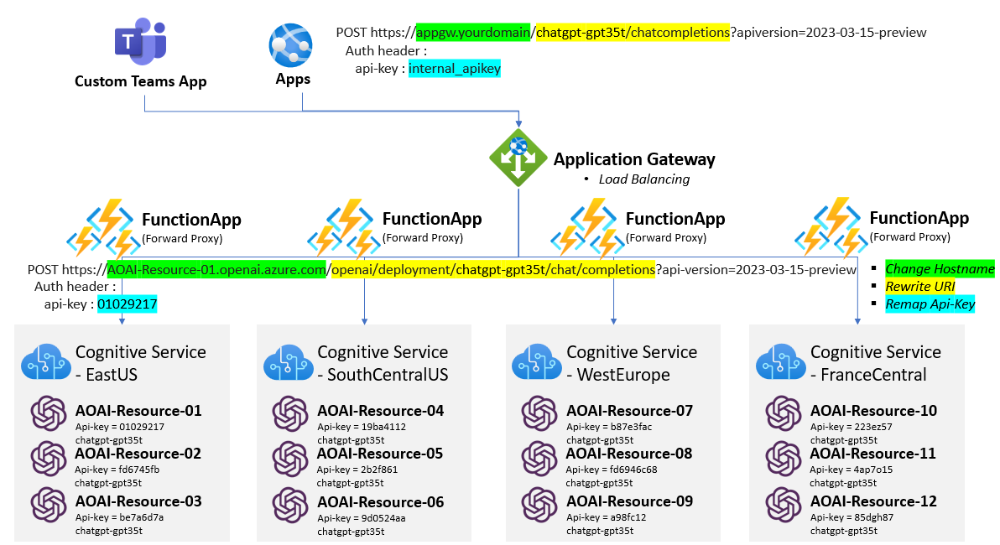

From this diagram, it is clear that all Apps will direct their API calls to a single AppGW endpoint (either via public IP or domain name). This endpoint will have a shorter URI path and an internal API key, granted by your AOAI admin, for user authentication. Access control of which authenticated parties can access the Function Apps can be dynamically controlled by this internal API key. Once AppGW has distributed the incoming API requests to the different Function Apps, it will convert the API requests to the actual AOAI API requests, with the actual AOAI domain name, longer URI path, and actual API key in the AUTH header section. 
- **shorter URI path** API caller only need to provides model-name,model-api, apiversion.
- **Internal apiKey** which is granted by AOAI admin, this apiKey is used for authentication within the AOAI service provided by you. You can dynamic control which authenticated parties can access the Function Apps by this internal apiKey.

## Functional Roles of Azure Components
- **Application Gateway**
  - Public CA certificate hosting
  - TLS termination
  - Load balancing
  - WAF and public IP restriction

- **Function App**
  - Forwarding proxy
  - Change Hostname
  - Rewrite URI path
  - Authenticate internal apiKey
  - Rewrite actual AOAI apiKey
  - User Access Control
  - Responsible AI Orchestration
  - Health Check endpoint for AppGW

- **App Service Plan**
  - only need one per region to support multiple Function Apps

## Responsible AI (RAI) Orchestration in your tenant
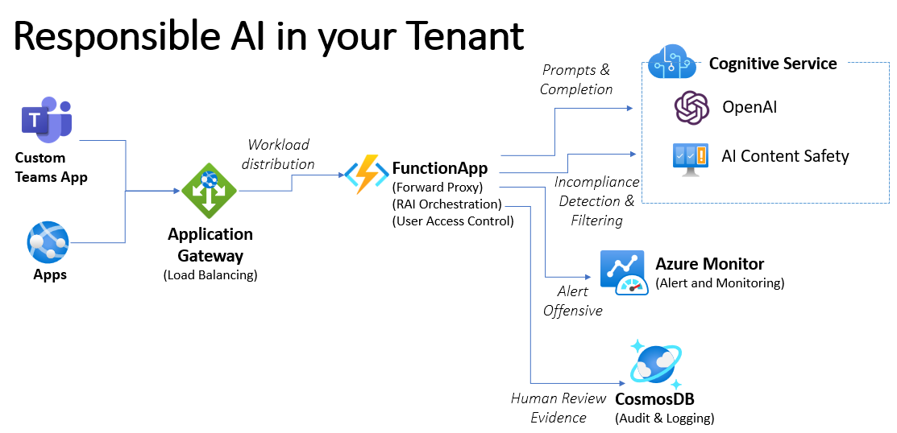

While most of enterprise customers likely opt-out of the Microsoft RAI mitigation approach ([Content Filtering and Abuse Monitoring](https://learn.microsoft.com/en-us/legal/cognitive-services/openai/data-privacy?context=%2Fazure%2Fcognitive-services%2Fopenai%2Fcontext%2Fcontext#how-can-a-customer-verify-if-logging-for-abuse-monitoring-is-off)). 
To comply with the [Azure OpenAI Code of Conduct and Terms of Use](https://learn.microsoft.com/en-us/legal/cognitive-services/openai/code-of-conduct), the customer must build their own RAI infrastructure. Leveraging the above architecture pattern can give you greater control and governance over your Function Apps. For instance, 
1. Incoming API request bodies without a 'User' or unregistered username can be rejected. 

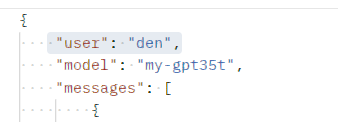

2. User prompts can be sent to Azure AI Content Safety for offensive content detection and filtering before reaching the AOAI resources. 
3. The username and corresponding content can be logged in CosmosDB if the prompt is non-compliant.


## Function App Configuration
1. [Create your first function in the Azure portal](https://learn.microsoft.com/en-us/azure/azure-functions/functions-create-function-app-portal)

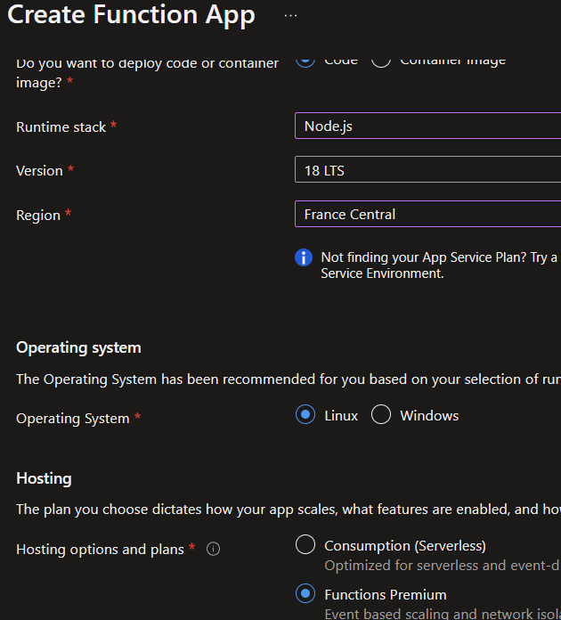

2. After Function App is created, Left blade > Configuration > Add Applilcation Settings > **Save**
```javascript    
    AOAI_HOSTNAME = {your AOAI resource domain}.openai.azure.com
    AOAI_INAPIKEY = {your internal apiKey for authenticated user}
    AOAI_OUTAPIKEY = {actual AOAI apikey}
```
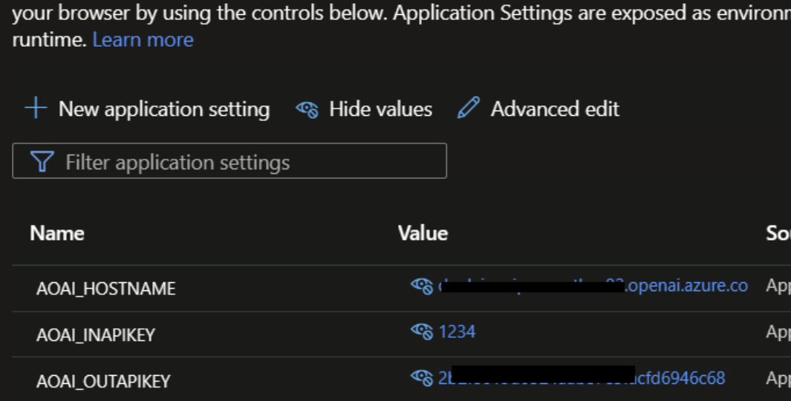

3. Left blade > Health check > add path > **Save**
```javascript  
/api/FwdProxy/openai/deployments/health/check
```
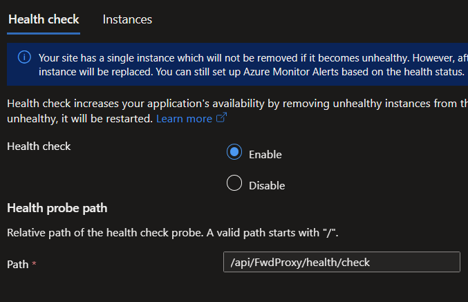

## Function App Forward Proxy Implementation
1. Please clone this repo into your local folder
```javascript  
git clone https://github.com/denlai-mshk/aoai-fwdproxy-funcapp.git
```
2. Open Visual Studio Code with this local folder
3. Install - extension: Azure Function, Azure Account
4. Left blade , click Azure icon > Workspace > mouse over the deploy icon

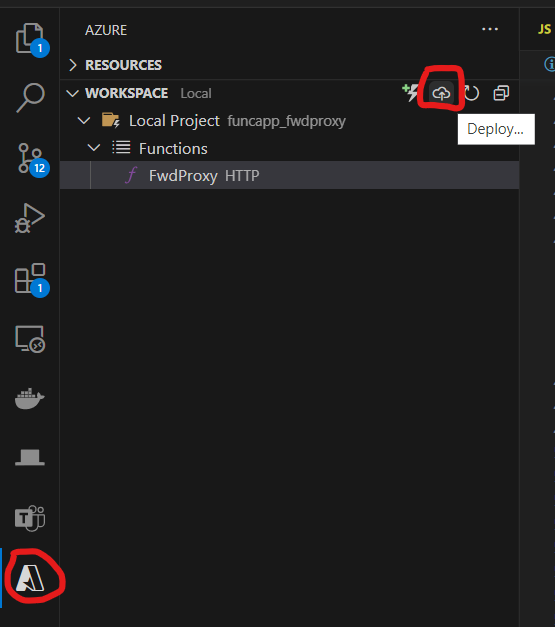

5. SSO your Microsoft account, select Azure subscription and Function App you just created.

## Application Gateway Configuration
1. [Create AppGW by Portal](https://learn.microsoft.com/en-us/azure/application-gateway/quick-create-portal)
2. [Backend pool and Backend setting](https://learn.microsoft.com/en-us/azure/application-gateway/create-ssl-portal)
3. You have to create 1 Routing rule bind with 1 Listener, 1 Backend pool and 1 Backend setting, the backend setting bind with 1 Health probe. (**Pay attention to the 600 seconds timeout setting, because the OpenAI model latency is subject to your inputs, models, model parameters and API types**)
4. Add multiple Function Apps into Backend pool 
5. Add 1 rewrite ruleset (extensionschatcompletion_99/chatcompletion_100/otherapi_101/healthcheck_102) bind with Routing rule
6. AppGW inbound and outbound are 443 port for TLS/SSL

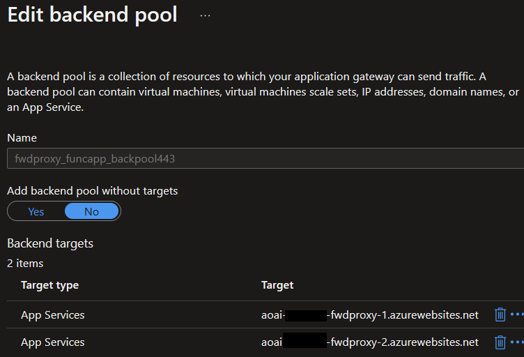

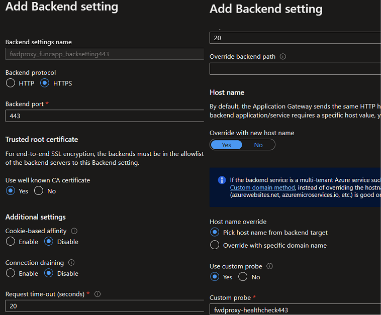

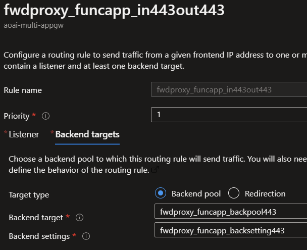

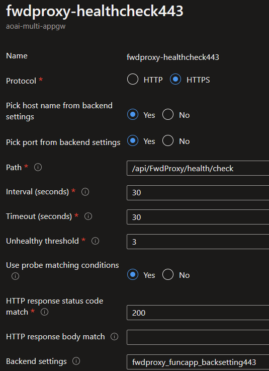

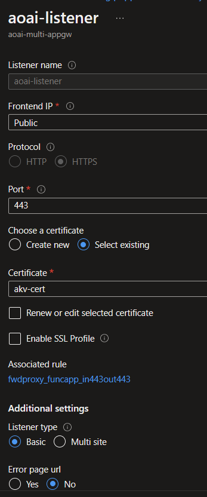

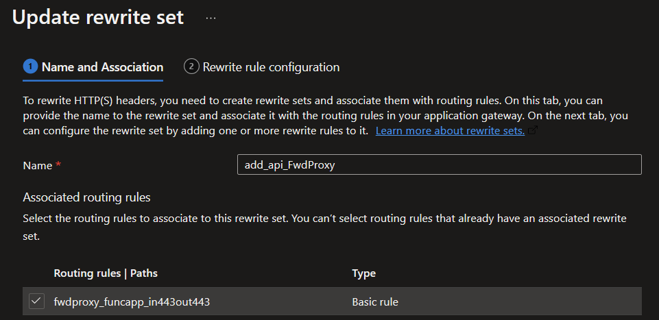

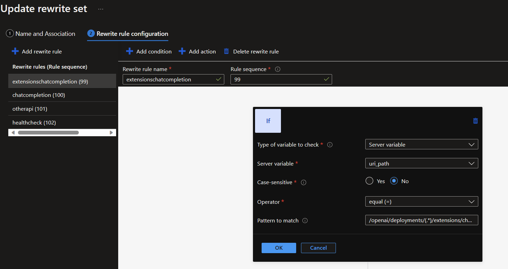

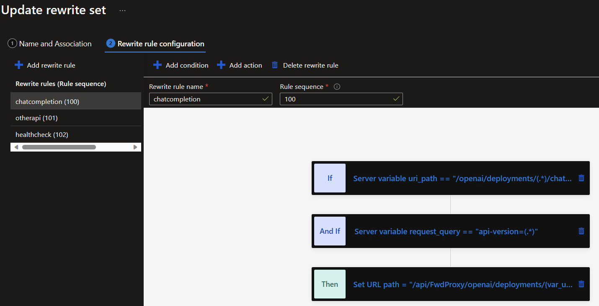


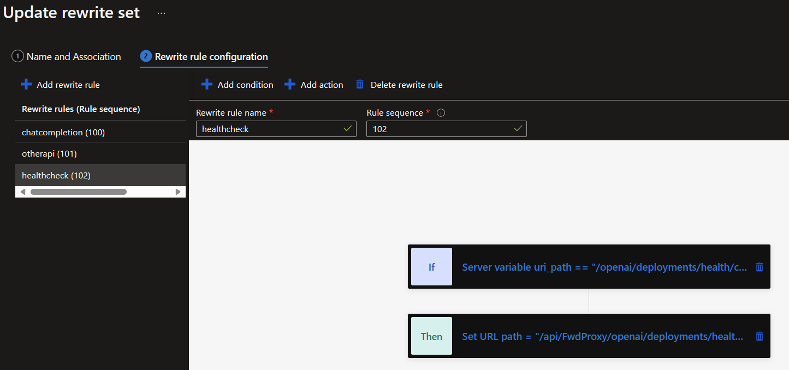

- **extensionschatcompletion(99)**
  ```javascript  
  if (server variable = uri_path) 
  equal
  /openai/deployments/(.*)/extensions/chat/completions

  and if (server variable = request_query) 
  equal
  api-version=(.*)

  then
  rewrite type = URL
  action type = Set
  Components = Both URL path and URL query string
  URL path value = /api/FwdProxy/openai/deployments/{var_uri_path_1}/extensionschatcompletions
  URL query string value = api-version={var_request_query_1}
  ```

- **chatcompletion(100)**
  ```javascript  
  if (server variable = uri_path) 
  equal
  /openai/deployments/(.*)/chat/completions

  and if (server variable = request_query) 
  equal
  api-version=(.*)

  then
  rewrite type = URL
  action type = Set
  Components = Both URL path and URL query string
  URL path value = /api/FwdProxy/openai/deployments/{var_uri_path_1}/chatcompletions
  URL query string value = api-version={var_request_query_1}
  ```
- **otherapi(101)**
  ```javascript  
  if (server variable = uri_path) 
  equal
  /openai/deployments/(.*)

  and if (server variable = request_query) 
  equal
  api-version=(.*)

  then
  rewrite type = URL
  action type = Set
  Components = Both URL path and URL query string
  URL path value = /api/FwdProxy/openai/deployments/{var_uri_path_1}
  URL query string value = api-version={var_request_query_1}
  ```
- **healthcheck(102)**
  ```javascript  
  if (server variable = uri_path) 
  equal
  /openai/deployments/health/check

  and if (server variable = request_query) 
  equal
  api-version=(.*)

  then
  rewrite type = URL
  action type = Set
  Components = URL path
  URL path value = /api/FwdProxy/openai/deployments/health/check
  ```
## How to test with PostMan
Well-known API tester Postman released OpenAI API profile for free. Get that [over here](https://www.postman.com/devrel/workspace/openai/documentation/13183464-90abb798-cb85-43cb-ba3a-ae7941e968da)

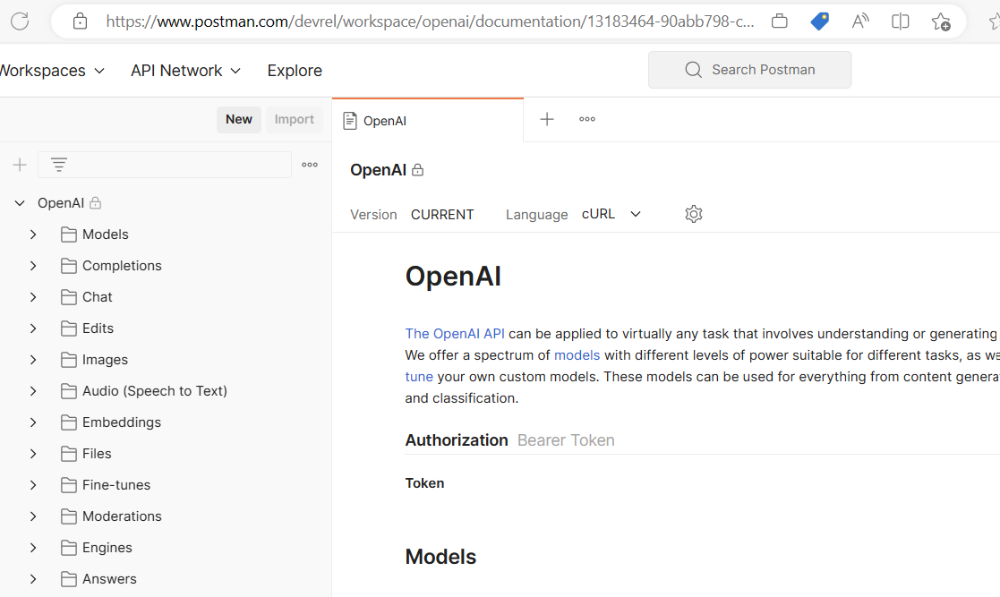

In postman, pass your internal apikey in auth header

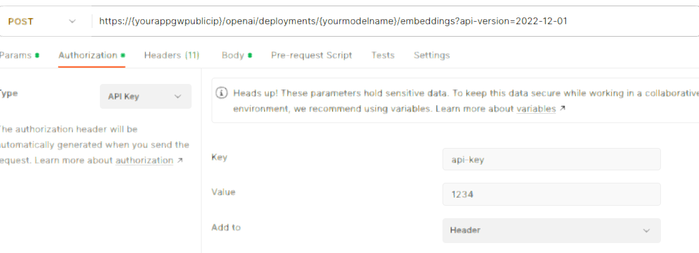

## Advanced Health Checking

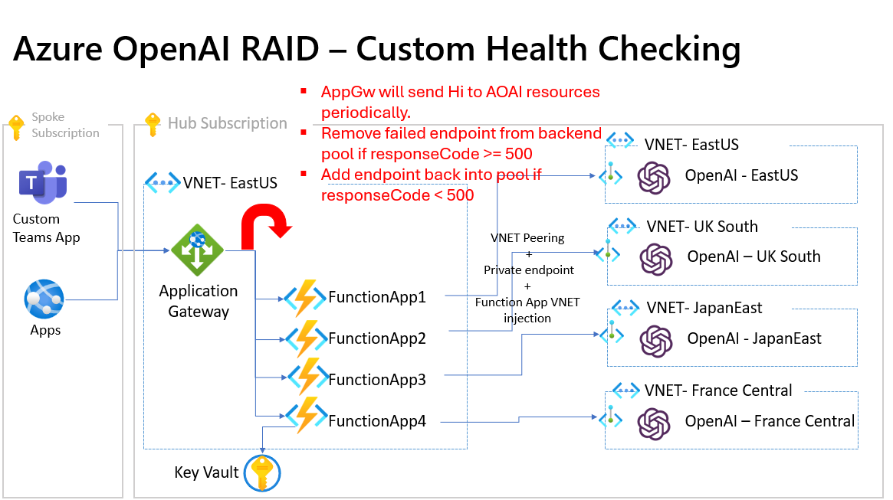

Based on observations and customer feedback, it has been noticed that your API may occasionally respond with HTTP 5xx errors. These errors are typically caused by the AOAI endpoints being overwhelmed due to high traffic. To address this issue, we can implement a more intelligent health check logic. This logic will enable your AppGW to automatically and temporarily remove any AOAI endpoint from the backend pool if it receives a 5xx response during the health check. During the next health check cycle, if the endpoint responds with a 200 status, AppGW will add it back to the backend pool. This approach ensures that only healthy endpoints are utilized by your application.

To implement the Advanced Health Checking capability, you can easily update the **path** in your custom health probe as follows:
 ```javascript
/api/FwdProxy/openai/deployments/{your_deployed_model_name}/aoaihealthcheck?api-version=2023-05-15
 ```
and modify the **HTTP response status code match = 200-499**

The **/aoaihealthcheck** URI path will generate a chatcompletion API request with a dummy prompt to your AOAI endpoints. This is specifically designed for testing the actual model latency. It is important to configure the **Interval** setting of this custom health probe to be triggered periodically in order to align with your budget plan.

By leveraging the **Timeout** capability of the custom health probe, you have the ability to enforce a specific latency requirement for AOAI endpoints. For example, you can set the timeout setting to 30 seconds, allowing the AppGW to automatically remove any AOAI endpoints that exceed this response time. This ensures that only endpoints meeting your desired latency criteria are utilized.

Lastly, when deploying this advanced health checking capability, it is important to note that the periodic API calls also contribute to the 240k TPS (Transactions Per Second) limit imposed on your AOAI endpoint per region per subscription. Therefore, it is advised to adjust the size of the dummy prompt context wisely in order to facilitate the health check purpose. For example, a simple prompt like "hi, I am healthcheck" can be used in the source code. This ensures that the health checks do not consume excessive resources and remain within the specified TPS limit.


## Go for Production To-Do List
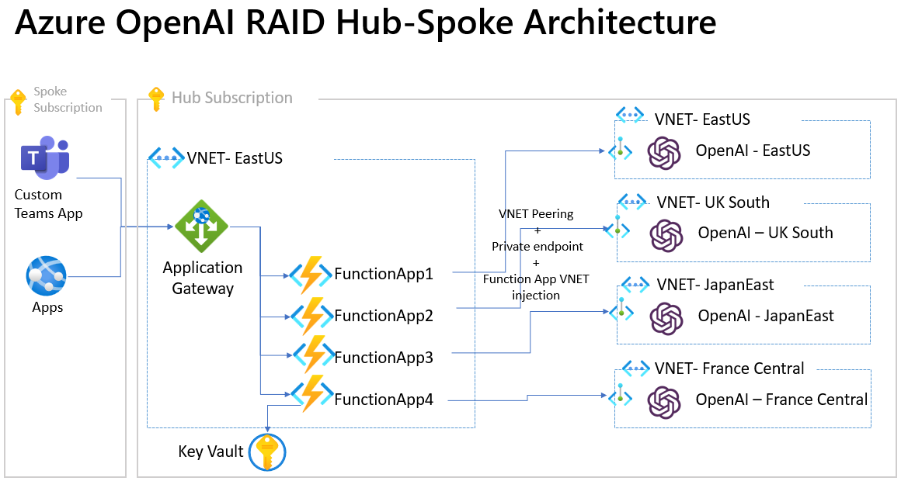

- It is highly recommended to adopt the Hub-Spoke best practices in order to centralize all AOAI resources within the hub subscription. This approach provides several benefits, including centralized Responsible AI governance and enhanced usage control such as user quotas. By centralizing the AOAI resources, you can effectively manage and monitor the AI capabilities in a more streamlined and controlled manner. This ensures that responsible AI practices are implemented consistently across the organization and allows for better control over resource allocation and usage.Responsible AI governance as well as usage control like user quotas. 
- Consider provisioning the Function App in VNET Injection mode for security. 
- Connect the AppGW and Function App within the same VNET. 
- Add a private endpoint to the AOAI Resources in your VNET.
- If public access is required for the AppGW, it is recommended to install a public CA certificate with domain name service. This ensures secure communication between the client and the AppGW. On the other hand, if public access is not necessary, it is advisable to bind the listener with the private IP of the AppGW. This configuration enforces that all incoming traffic is transmitted within the private VNET, enhancing the security and privacy of the network communication.
- Secure the AOAI endpoint and API key in the Azure Key Vault or use AAD RBAC instead.
- Consider provisioning the CosmosDB for abuse auditing.
- Consider provisioning the [Azure AI Content Safety](https://learn.microsoft.com/en-us/azure/cognitive-services/content-safety/overview) for content filtering and detection.
